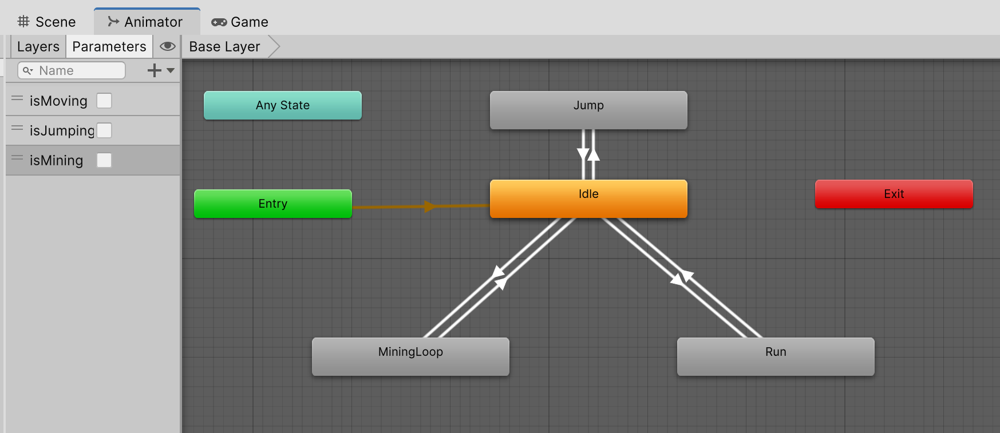
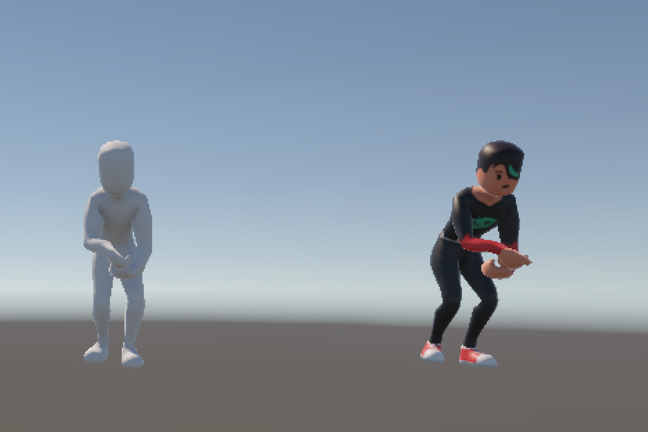
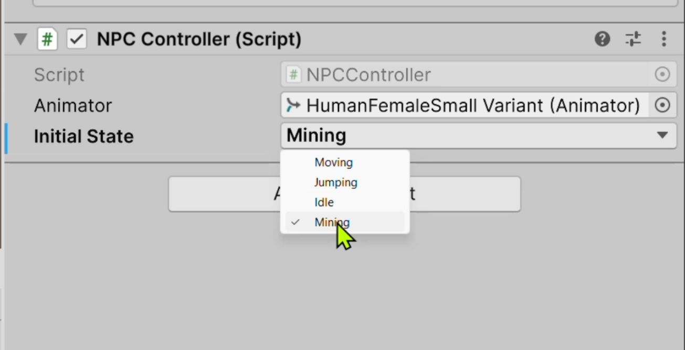
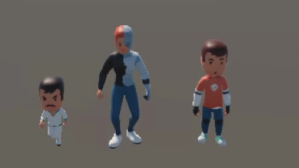
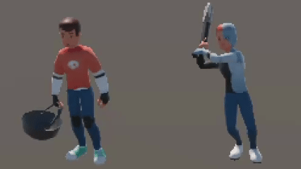

----

[TOC]

----

# Expanding Model Animations
- link: 
- Author: 

## Unity, quick reminder of QWERTY tools:

| Command | Tool/Mode | Description |
| :--- | :--- | :--- |
| **Q** | Hand | For panning and navigating the Scene view. |
| **W** | Move | For translating (moving) objects along their X, Y, and Z axes. |
| **E** | Rotate | For rotating objects around their local or global axes. |
| **R** | Scale | For uniformly or non-uniformly scaling (stretching/resizing) objects. |
| **T** | Rect Transform | Primarily used for UI elements and 2D objects. |
| **Y** | Transform | A combination of the Move, Rotate, and Scale tools in a single gizmo. |

# Housekeeping
- I am using 6000.4.3f1 (Supported)
- Universal Render Pipeline is active
- In my notes, I  refer to panels as:

| &nbsp; Panel Name &nbsp; | &nbsp; Short Form &nbsp; | &nbsp; Description &nbsp; |
| :--- | :--- | :--- |
| &nbsp; Scene | &nbsp; **S** | &nbsp; Where you can drag objects and build 3D scene |
| &nbsp; Hierarchy | &nbsp; **H** | &nbsp;  See objects and their inheritance |
| &nbsp; Inspector | &nbsp; **I** | &nbsp; Detailed information on components for selected object &nbsp;|
| &nbsp; Project | &nbsp; **P** | &nbsp;  See resources relative to file directory |
| &nbsp; Game | &nbsp; **G** | &nbsp; Where the game is played |

# Setup
- create a 3D (URP) Core project
- Name: Expanding\_Model\_Animations
- Remove the Readme Assets from URP

## Packages Needed
### Grab your models package
- rclick P; Import Package - Custom Package: Kenney\_Medium\_All\_jump\_idle\_run.unitypackage
- Import all of it

### Grab some animations
- need "FREE Low Poly Human - RPG Character" from assetstore.unity.com
    - if you have not yet downloaded
        - Asset Store is opened from Unity
        - search for (above)
        - add to my assets
        - click Open In Unity
    - Opens Package Manager
    - My Assets
    - FREE Low Poly Human - RPG Character
    - Import  (careful here; it comes with a lot of garbage; we are going to pick some stuff)
    - select the following (only):
<pre style="background-color: #1a1a1a; color: #ffffff; padding:15px; margin:5px">
Blink
  Art
    Animations
      Animations_Starter_Pack
        Combat
          BlockingLoop.fbx
          BowShot.fbx
          Buff.fbx
          CastingLoop.fbx
          Death.fbx
          GetHit.fbx
          IdleCombat.fbx
          MeleeAttack_OneHanded.fbx
          MeleeAttack_TwoHanded.fbx
          PunchLeft.fbx
          PunchRight.fbx
          SpellCast.fbx
          StunnedLoop.fbx
        Gathering
          Gathering.fbx
          MiningLoop.fbx
        Movement
          FallingLoop.fbx
          Idle.fbx
          Jumps.fbx
          JumpWhileRunning.fbx
          RollBackward.fbx
          RollForward.fbx
          RollLeft.fbx
          RollRight.fbx
          RunBackward.fbx
          RunBackwardLeft.fbx
          RunBackwardRight.fbx
          RunForward.fbx
          RunLeft.fbx
          RunRight.fbx
          Sprint.fbx
          StrafeLeft.fbx
          StrafeRight.fbx
</pre>
    - Import
    - Close Package Manager
    - Drag P, .. Combat to P, \kenney\Animations
    - Drag P, .. Gathering to P, \kenney\Animations
    - Drag P, .. Movement to P, \kenney\Animations
    - Delete Assets/Blink

## Adding Animations
### Set up a Prefab for testing
- drag P, \_kenney\Prefabs\HumanFemale onto H
- H, Main Camera
    - Position: 0 1 8
    - Rotation: 0 180 0
- H, HumanFemale
    - drag Animator into Female
    - observe that Animator Controller is NPC

### add animation
- dclick, - H, HumanFemale ... NPC
- should look like this:
<pre style="background-color: #1a1a1a; color: #ffffff; padding:15px; margin:5px">
[Any State]     [   Jump   ]
                  |      |
                  v      ^
                  |      |
[Entry]--->-----[   Idle   ]     [Exit]
                  |      |
                  v      ^
                  |      |
                [   Run    ]
</pre>
- drag p, Assets, \_kenney\Animations\Gathering\MingingLoop onto Animator
- this creates two blocks, MiningLoop and tpose. Delete tpose
- rclick MiningLoop, set as default
- run
- observe the character "mining"
### Add a bool
- Animator, + Parameters
- isMining [ ]
### Set up transition from Idle to Mining
- Animator, Idle; set as default
- add trans from Idle to MiningLoop
    - Conditions, isMining, true
- add trans from MiningLoop to Idle
    - Conditions, isMining, false
    
### Code
- open NPCController.cs
- (this is getting to be a bad name, lol.)
- add a case for isMining
<pre style="background-color: #1a1a1a; color: #ffffff; padding:15px; margin:5px">
    public void SetState(String state)
    {
        if (animator == null)  return; 

        switch (state)
        {
            case "isMoving":
                animator.SetBool("isMoving", true);
                break;
            case "isJumping":
                animator.SetBool("isJumping", true);
                break;
            case "isMining": // <-- here
                animator.SetBool("isMining", true);
                break;

            default:
                animator.SetBool("isMoving", false);
                animator.SetBool("isJumping", false);
                animator.SetBool("isMining", false); // <-- here

                break;
        }
    }
</pre>

# Summary
- repeat for any animations you want
- this works because blink and kenney are using same rig conventions
- so it may not always work (actually, this was lucky)
- this has the potential to get very messy; I will explore ways to get around that

# Creatively borrow from another project
- in the Store Simulator Project (see quick: 030) , there is assets
<pre style="background-color: #1a1a1a; color: #ffffff; padding:15px; margin:5px">
unity_projects\Store Simulator\Assets\_Store Simulator Assets\Models\Kenney Character Assets\Models
...
characterLargeFemale.fbx
characterLargeMale.fbx
characterMedium.fbx
characterSmall.fbx
</pre>
- we already use: characterMedium.fbx
- so the question is, can we use our existing skins and animations on say characterLargeFemale.fbx ?

## Copy Assets
- drag from OS folder above the file characterLargeFemale.fbx into P, Assets, \_kenney, Model
- select characterLargeFemale
- Rig
    - Animation Type: Humaniod
    - Apply
## Build Prefab
- move HumanFemale Position: -12 0 0   (out of the way)
- drag characterLargeFemale onto H; rename BaseLargeModelFemale
    - add Animator
    - drag P. Assets, Animations, NPC onto Controller
    - Avatar, set to characterLargeFemaleAvatar
    - [x] Apply Root Motion
    - Culling mode: Cull Update Transforms
- run. Not that the large model is now idling
- add NPCCOntroller script
    - drag Animotr onto it
    - set intial State to : isMoving
    - run, Observe the model is running
    - set intial State to : isJumping
    - run, Observe the model is , well, jumped
    - set intial State to : isMining
    - run, Observe the model is mining 
- P, Assets, \_kenney, Prefabs; create Folder LargeFemale
- drag H, BaseLargeModelFemale into P, Assets, \_kenney, Prefabs, LargeFemale

## Skin 
- dupe H, BaseLargeMOdelFemale; rename SkaterFemaleLarge
- H, SkaterFemaleLarge, characterLargeFemale
     - Material, Element 0; skaterFemaleA
     - Position: -4 0 0 
- run, should have:
    

## Variant Prefab
- drag H, SkaterFemaleLarge into Assets, \_kenney, Prefabs, LargeFemale
- now, any changes to the BaseLargeModelFemale will migrate to its variants

## repeat this for
<pre style="background-color: #1a1a1a; color: #ffffff; padding:15px; margin:5px">
CyborgFemale
HumanFemale
SkaterFemale
ZombieFemale
</pre>

## Males Large

- create BaseLargeModelMale
- then make variants
<pre style="background-color: #1a1a1a; color: #ffffff; padding:15px; margin:5px">
CriminalMale
HumanMale
SkaterMale
ZombieA
ZombieC
ZombieMale
</pre>

## And again for Small models
- create BaseSmall
- and variants (no need for Male/Female):
<pre style="background-color: #1a1a1a; color: #ffffff; padding:15px; margin:5px">
criminalMaleA
cyborgFemaleA
humanFemaleA
humanMaleA
skaterFemaleA
skaterMaleA
zombieA
zombieC
zombieFemaleA
zombieMaleA
</pre>

# Fixing the NPCController
- open script
- remove the Update
- note: to avoid misspelling, use enumeration
- modify:
<pre style="background-color: #1a1a1a; color: #ffffff; padding:15px; margin:5px">
public class NPCController : MonoBehaviour
{
    public Animator animator;
    public AnimationState initialState = AnimationState.Idle; //<-- here

    // Start is called once before the first execution of Update after the MonoBehaviour is created
    void Start()
    {
        SetState(initialState);
    }

    public void SetState(AnimationState state)
    {
        if (animator == null)  return; 

        switch (state)
        {
            case AnimationState.Moving: // <-- here
                animator.SetBool("isMoving", true);
                break;
            case AnimationState.Jumping: // <-- here
                animator.SetBool("isJumping", true);
                break;
            case AnimationState.Mining: // <-- here
                animator.SetBool("isMining", true);
                break;

            default:
                animator.SetBool("isMoving", false);
                animator.SetBool("isJumping", false);
                animator.SetBool("isMining", false); 
                break;
        }
    }
    public enum AnimationState  // <-- here
    {
        Moving, Jumping, Idle, Mining
    }
}
</pre>
- save, unity
- observe that you have pulldown with options

- open script
- expand enumeration:
<pre style="background-color: #1a1a1a; color: #ffffff; padding:15px; margin:5px">
    public enum AnimationState
    {
        Moving, Jumping, Idle, Mining,
        BlockingLoop, BowShot, Buff, CastingLoop,
        Death, GetHit, IdleCombat, MeleeAttack_OneHanded,
        MeleeAttack_TwoHanded, PunchLeft, PunchRight, SpellCast,
        StunnedLoop, Gathering, MiningLoop, FallingLoop,
        Jumps, JumpWhileRunning, RollBackward, RollForward,
        RollLeft, RollRight, RunBackward, RunBackwardLeft,
        RunBackwardRight, RunForward, RunLeft, RunRight,
        Sprint, StrafeLeft, StrafeRight
    }
</pre>
- note: we have not implemented these
- the switch will fall to the default behaviour

## Add another animation: SpellCast
- while we already have SpellCast in the list, move it up to first line
- (that is just to make it easier to track what is done)
- add a case:
<pre style="background-color: #1a1a1a; color: #ffffff; padding:15px; margin:5px">
            case AnimationState.SpellCast: 
                animator.SetBool("isSpellCast", true);
                break;
</pre>
- add default
<pre style="background-color: #1a1a1a; color: #ffffff; padding:15px; margin:5px">
            default:
                animator.SetBool("isMoving", false);
                animator.SetBool("isJumping", false);
                animator.SetBool("isMining", false); 
                animator.SetBool("isSpellCast", false); // <-- here
                break;
</pre>
- save, unity
- Animator
    - Parameters, +, Bool; isSpellCast
    - drag in: Assets, _kenney, Animations, Combat, SpellCast
    - delete tpose, SpellCast\_End, SpellCast\_start
    - make transition from Idle to SpellCast
        - add a condition, isSpellCast true
    - make transition from SpellCast to Idle
        - add a condition, isSpellCast false
- set CyborgFemaleSmall Initial State to Spell Cast
- run, observe looping spell cast animation
- following steps above, add in Gathering

## Notes
- you can add most animations this way
- you can also mess around with intermediate steps, timeing, etc
- you need to call SetState to change state

# Adding a pickaxe
## Create pickaxe prefab
- drag Pickaxe on H
    - you will need to find or build one
- drag Skins, Pickaxe_smoothnessMetalic into S onto PickAxe
    - from my borrowed pick axe
- drag H, Pickaxe into P, Assets, _kenney, Prefabs, Misc
    - this creates a pickaxe prefab we can use
- delete H, Pickaxe

## Put pickaxe into a character
- on a new scene, or remove stuff from existing
- drag P, Assets,\_kenney, Prefabs, LargeFemale, BaseLargeModelFemale.prefab onto scene
- H, BaseLargeModelFemale, Root, HipsCtrl, Hips, Spine, Chest, UpperChest, RightShoulder, RightArm, RightForeArm, RightHand; drag P, Assets, \_kenney, Prefabs, Misc, Pickaxe
    - Position: 0.00154 0.00142 -0.00077
    - Rotation: -166.79 -90 85.243 
    - Scale: 0.5 0.5 0.5
    - deactivate [ ]

## Script
- we only want the pickaxe visible when we mining
- add a Gameobject for the pickaxe
<pre style="background-color: #1a1a1a; color: #ffffff; padding:15px; margin:5px">
...
    public GameObject pickAxe; // <-- here
...
    public void SetState(AnimationState state)
    {
...
            case AnimationState.Mining: 
                if (pickAxe) pickAxe.SetActive(true); // <-- here
                animator.SetBool("isMining", true);
                break;
...
            default:
                if (pickAxe) pickAxe.SetActive(false); // <-- here
...
</pre>
- note: we don't propagation (`pickAxe?.SetActive(true)`) because unity doesn't like that :-(
- save, unity
- drag Pickaxe into H, BaseLargeFemaleModel, Pick Axe
- set Initial State to Mining
- run, observe pickaxe
- if you run again in a a different state (moving for example) there will be no pickaxe
- H, BaseLargeFemaleModel; I, Overrides, Apply All
- delete H, BaseLargeFemaleModel
- drag P, Assets, _kenney, Prefabs, LargeFemale, CyborgFemaleLarge Variant into H
    - Initial State: Mining
- run, observe mining
- stop
   - Initial State: Moving
- run, observe running, no mining

## Practice, add a basket to BaseLargeModelMale
- try to replicate, using a basket model, Gathering
    - Position: -0.0002 0.0051 0.0023
    - Rotation: 85.383 141.952 303.69
    - Scale: 0.75 0.75 0.75
- something like this:

- maybe with a better basket, lol

## Notes
- this can/will grown into a mess of if statements
- we should consider creating a family of "states", assigning via the case, and then invoking their behaviours
- let me get back to this later
